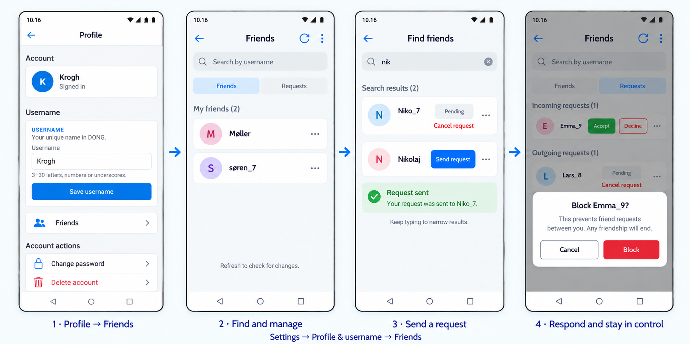
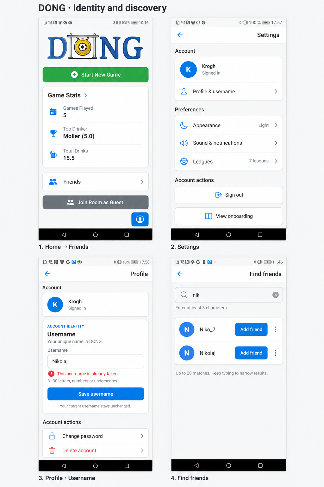
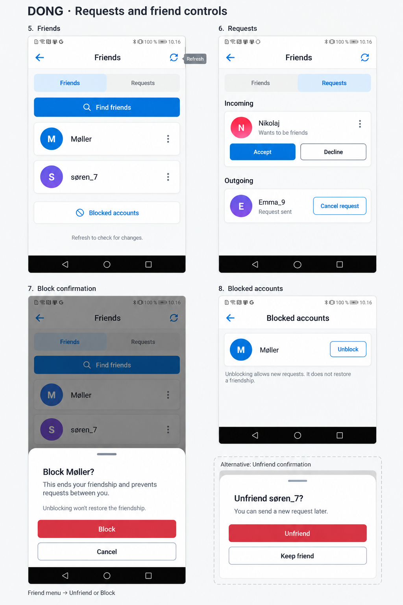

# Proposed visual workflow

These imagegen concepts extend the user's supplied DONG screenshots. They are design proposals for review, not screenshots of implemented or device-tested behavior. Text and behavioral contracts in the specification remain authoritative.

## Revised direction

The current v4 direction uses denser cards, prominent search, and pastel initial avatars within DONG styling. Home remains unchanged. Earlier boards are historical references only; their Home modifications and alternative navigation must not be implemented.

- Entry point: existing Settings → Profile & username → Friends. Add a Friends navigation row to Profile, below username editing and above account actions. Keep the existing Home layout, game cards, and account shortcut unchanged.
- Friends has two segments: Friends and Requests. Search sits above them and opens Find friends; it searches accounts rather than merely filtering existing friends. Rarely used Blocked accounts management opens from the Friends header overflow menu; it has no tab or prominent bottom link. The existing Unblock behavior is unchanged.
- Use Send request consistently. A confirmed send changes that row to Pending with Cancel request, and shows a short success message. Keep outgoing requests under Requests as well.
- Use a compact centered confirmation for Block/Unfriend, with explicit Cancel and destructive controls. The fourth frame shows an optional overflow-menu branch; opening Requests never automatically opens this dialog. The board arrows communicate the broad journey, not an automatic transition after sending.
- This visual reference does not add separate display names, online presence, messaging, mutual-friend statistics, leaderboards, a global bottom tab bar, or request badges on Home.

## Earlier supporting concepts

## Navigation and actions

1. Use existing navigation to Settings → Profile & username → Friends. The Profile row uses the familiar white card, blue people icon, and chevron. No Home-screen changes are included.
2. Signed-out users follow existing Sign in / Create account. Registered users without a username see Choose username before entering Friends. Reuse the profile username form, label its action Continue, and return to the original destination after a successful save. Do not add a second display-name field.
3. Settings → Profile & username. Edit the single username with the current account identity still visible. Show validity/taken errors next to the field, preserve entered text, and change the account heading only after a successful save. Board 1 deliberately depicts a failed rename from Krogh to taken Nikolaj. Initial setup uses the same field rules. Remove History import and the otherwise empty Data group; keep other preferences and account actions.
4. Friends opens on the Friends tab. Find friends opens a dedicated prefix-search screen. Fewer than three normalized characters shows guidance and no directory; a valid prefix shows up to 20 eligible accounts. Tap Send request to submit. After confirmation, replace that action with Pending and offer Cancel request; outgoing state also appears in Requests. Incoming or accepted matches show their current relationship and appropriate actions, never a duplicate Add friend action.
5. Requests groups Incoming and Outgoing on one screen. Incoming offers Accept and Decline; Outgoing offers Cancel request. Accept moves the person to Friends after confirmation. Decline removes the request; a deliberate new send is allowed immediately. A failed action stays recoverable and does not claim success.
6. Each applicable person row has an accessible More actions menu. Accepted friends offer Unfriend and Block; search and incoming/outgoing entries offer Block. Unfriend and Block use distinct confirmation sheets explaining the consequence. Unfriend ends friendship but permits future requests. Block ends friendship and prevents requests in both directions.
7. Friends → header More options → Blocked accounts lists only the user's own blocks. Unblock removes only that block and does not restore friendship. If the other account has also blocked the user, interaction remains unavailable without revealing the other block.
8. Refresh uses a visible accessible header action on web/native, plus a fetch when opening or returning to Friends. Counts, if added inside Friends, reflect the last confirmed read. There are no live social indicators elsewhere. The refresh tooltip on board 2 illustrates its label, not permanently visible mobile chrome.

## States and platform behavior

- Empty Friends: reuse the existing pale empty-state panel, people icon, No friends yet, and Find friends action. Empty Requests: No requests yet. No matches: No usernames found with guidance to change the prefix.
- Loading disables only the affected action and exposes progress. A failed list fetch shows Could not load friends and Retry; it must not look like an empty list. Preserve valid cached content with an error notice when appropriate.
- Stale cancel/accept actions refresh the row and explain that the request changed. A username change after selection requires reconfirming the target; actions never retarget by name.
- On web, use a centered readable content width and the same hierarchy. Keyboard users can reach search, tabs, row menus, refresh, and confirmation controls. Restore focus after closing a dialog. Long usernames wrap or truncate accessibly; controls retain usable touch targets and labels.
- Visual vocabulary: pale gray background, white lightly bordered rounded cards, subtle shadow, blue outline icons and primary buttons, pale blue selected tabs, initial avatars, muted gray secondary text, red destructive actions. Preserve existing theme tokens for dark mode rather than deriving colors from the generated pixels.
- Friendships do not add people to a game automatically. Gameplay, history statistics, and room invitation flows are unchanged by these mockups. Backend refactors do not need extra user-facing settings.

## Implementation handoff

Use these boards to guide slice E of the plan and username/settings portions of slices B/F. Build with existing reusable UI controls and theme tokens. The generated mockups have small illustrative differences in density and avatar color; they are not pixel specifications. Validate actual web/native layouts, error recovery, and accessibility during implementation.

Exact generation prompts are retained in [prompts.md](prompts.md). Originals remain in the image-generation output directory; the project copies above are the review artifacts.
